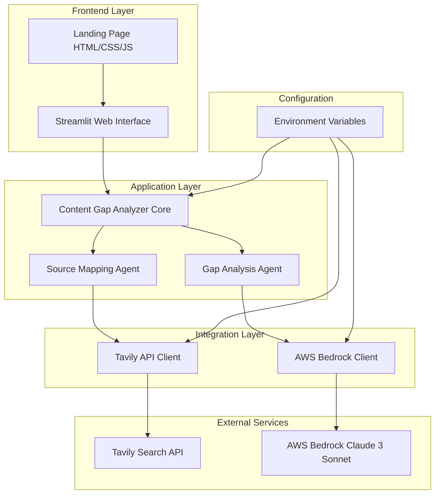
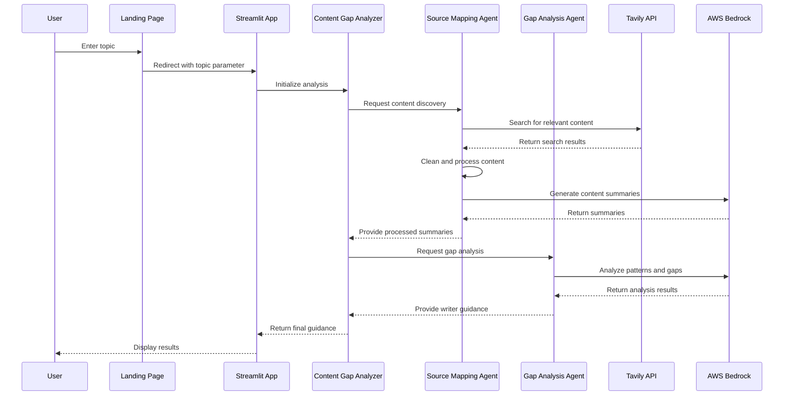

# Design Document: Content Gap Analyzer

## Overview

The Content Gap Analyzer is a sophisticated AI-powered web application that helps content creators identify unique angles for blog topics by analyzing existing content landscapes. The system employs a dual-agent architecture to process web content and generate strategic writing guidance rather than creating content directly.

The application follows a client-server architecture with a modern glass morphism frontend and a Python-based backend powered by Streamlit. The system integrates with external APIs (Tavily for web search, AWS Bedrock for AI analysis) to provide comprehensive content gap analysis and strategic recommendations.

## Architecture

### High-Level Architecture



### Component Architecture

The system follows a modular design with clear separation of concerns:

1. **Presentation Layer**: Static HTML landing page with modern UI design
2. **Application Layer**: Streamlit-based web application handling user interactions
3. **Business Logic Layer**: Dual-agent system for content analysis
4. **Integration Layer**: API clients for external service communication
5. **Configuration Layer**: Environment-based configuration management

### Data Flow



## Components and Interfaces

### Core Components

#### 1. Content Gap Analyzer Core (`app.py`)
**Purpose**: Main orchestrator coordinating the analysis workflow
**Responsibilities**:
- User interface management via Streamlit
- Progress tracking and user feedback
- Workflow coordination between agents
- Error handling and retry logic

**Key Methods**:
```python
def analyze_topic(topic: str) -> WriterGuidance
def display_progress(step: int, message: str) -> None
def handle_errors(error: Exception) -> None
```

#### 2. Source Mapping Agent (`utils/analyzer.py`)
**Purpose**: Discovers, retrieves, and processes web content
**Responsibilities**:
- Web content discovery via Tavily API
- Content cleaning and normalization
- AI-powered content summarization
- Source quality validation

**Key Methods**:
```python
def discover_content(topic: str) -> List[ContentSource]
def clean_web_text(text: str) -> str
def summarize_source(title: str, content: str, topic: str) -> str
```

#### 3. Gap Analysis Agent (`utils/analyzer.py`)
**Purpose**: Identifies content gaps and generates strategic guidance
**Responsibilities**:
- Pattern analysis across content sources
- Gap identification and categorization
- Strategic guidance generation
- Differentiation opportunity detection

**Key Methods**:
```python
def perform_gap_analysis(summaries: List[Summary], topic: str) -> WriterGuidance
def identify_patterns(summaries: List[Summary]) -> PatternAnalysis
def generate_guidance(analysis: PatternAnalysis) -> WriterGuidance
```

### External Service Interfaces

#### Tavily API Integration
**Configuration**:
- API Key: Environment variable `TAVILY_API_KEY`
- Client: `TavilyClient` from `tavily-python` package
- Rate Limiting: Built-in client handling

**Interface Methods**:
```python
def search(query: str, max_results: int = 5, include_raw_content: bool = True) -> SearchResults
```

**Response Format**:
```python
{
    "results": [
        {
            "title": str,
            "url": str,
            "content": str,
            "raw_content": str,
            "score": float
        }
    ]
}
```

#### AWS Bedrock Integration
**Configuration**:
- Region: Environment variable `AWS_REGION` (default: us-east-1)
- Model: `anthropic.claude-3-sonnet-20240229-v1:0`
- Credentials: AWS credential chain (environment, IAM, etc.)

**Interface Methods**:
```python
def invoke_model(modelId: str, body: str) -> ModelResponse
```

**Request Format**:
```python
{
    "anthropic_version": "bedrock-2023-05-31",
    "max_tokens": 800,
    "temperature": 0.9,
    "messages": [
        {"role": "user", "content": str}
    ]
}
```

### User Interface Components

#### Landing Page Interface
**Technology**: HTML5, CSS3, JavaScript, Tailwind CSS
**Features**:
- Glass morphism design with backdrop blur effects
- Responsive layout with mobile-first approach
- Interactive animations and smooth transitions
- Topic input form with validation

**Key Elements**:
- Hero section with value proposition
- How-it-works explanation with step cards
- Topic input interface with search functionality
- Progress indicators and loading states

#### Streamlit Application Interface
**Technology**: Streamlit framework with custom CSS
**Features**:
- Real-time progress tracking
- Dynamic content rendering
- Error handling with user-friendly messages
- Responsive design matching landing page aesthetics

## Data Models

### Core Data Structures

#### ContentSource
```python
@dataclass
class ContentSource:
    title: str
    url: str
    content: str
    raw_content: str
    score: float
    processed_at: datetime
```

#### ContentSummary
```python
@dataclass
class ContentSummary:
    title: str
    summary: str
    key_themes: List[str]
    word_count: int
    source_url: str
```

#### PatternAnalysis
```python
@dataclass
class PatternAnalysis:
    overused_angles: List[str]
    missing_perspectives: List[str]
    underexplored_questions: List[str]
    differentiation_opportunities: List[str]
```

#### WriterGuidance
```python
@dataclass
class WriterGuidance:
    topic: str
    analysis_summary: str
    overused_angles: List[str]
    missing_perspectives: List[str]
    underexplored_questions: List[str]
    differentiation_opportunities: List[str]
    generated_at: datetime
```

### Configuration Models

#### SystemConfiguration
```python
@dataclass
class SystemConfiguration:
    tavily_api_key: str
    aws_region: str
    bedrock_model_id: str
    max_content_sources: int = 5
    content_char_limit: int = 4000
    summary_word_limit: int = 150
    ai_temperature: float = 0.9
    max_tokens: int = 800
```

#### RetryConfiguration
```python
@dataclass
class RetryConfiguration:
    max_attempts: int = 3
    min_wait_seconds: int = 10
    max_wait_seconds: int = 60
    exponential_base: int = 2
```

## Correctness Properties

*A property is a characteristic or behavior that should hold true across all valid executions of a system—essentially, a formal statement about what the system should do. Properties serve as the bridge between human-readable specifications and machine-verifiable correctness guarantees.*

Based on the prework analysis, I've identified properties that can be combined for comprehensive testing while eliminating redundancy. The following properties focus on the core system behaviors that can be automatically verified:

### Property 1: Input Validation Consistency
*For any* string input, the system should accept inputs up to 200 characters that contain non-whitespace content, and reject inputs that are empty, whitespace-only, or exceed the character limit
**Validates: Requirements 1.1, 1.2, 1.4**

### Property 2: Content Processing Pipeline Integrity  
*For any* valid topic input, initiating analysis should trigger the complete workflow sequence: API querying, content retrieval, processing, and guidance generation
**Validates: Requirements 1.3, 2.1, 4.1**

### Property 3: Content Retrieval Completeness
*For any* successful search operation, all returned content sources should contain both title and content fields, and the system should retrieve at least 5 sources when available
**Validates: Requirements 2.2, 2.3**

### Property 4: Retry Logic Consistency
*For any* failed API operation, the system should implement exponential backoff retry logic with a maximum of 3 attempts before failing gracefully
**Validates: Requirements 2.4, 6.2**

### Property 5: Content Processing Standardization
*For any* raw content input, the cleaning process should remove URLs and normalize whitespace, and content should be truncated to 4000 characters for analysis
**Validates: Requirements 3.1, 3.2**

### Property 6: Summary Format Compliance
*For any* generated summary, the output should be in bullet-point format with a maximum of 150 words
**Validates: Requirements 3.4**

### Property 7: Error Resilience
*For any* processing failure on individual content sources, the system should continue processing remaining sources and provide graceful error handling without system crashes
**Validates: Requirements 3.5, 8.3**

### Property 8: Guidance Structure Consistency
*For any* completed analysis, the generated writer guidance should contain all required sections (overused angles, missing perspectives, underexplored questions, differentiation opportunities) in bullet-point format without prose paragraphs
**Validates: Requirements 4.5, 5.1, 5.2, 5.3**

### Property 9: Content Generation Restriction
*For any* system output, the guidance should contain strategic direction and analysis but should not include generated article content or narrative prose
**Validates: Requirements 5.5**

### Property 10: AI Service Configuration Consistency
*For any* AI API request, the system should use the correct model (Claude 3 Sonnet), token limits (800-900), and temperature settings (0.9)
**Validates: Requirements 6.1, 6.3, 6.4**

### Property 11: Performance Timing Bounds
*For any* topic analysis under normal conditions, the complete workflow should finish within 2 minutes
**Validates: Requirements 8.1**

### Property 12: Configuration Security
*For any* system deployment, all API keys and sensitive configuration should be loaded from environment variables with no hardcoded secrets in the codebase
**Validates: Requirements 9.1, 9.2**

### Property 13: Environment Validation
*For any* system startup, the application should validate all required dependencies and API access before allowing user interactions
**Validates: Requirements 9.4, 9.5**

### Property 14: Content Format Handling
*For any* web content input, the system should successfully process HTML, plain text, and mixed format sources while handling special characters and encoding issues gracefully
**Validates: Requirements 10.1, 10.3**

### Property 15: Content Quality Filtering
*For any* retrieved content sources, empty or minimal content should be excluded from analysis, and the system should attempt to retrieve additional sources when content quality is insufficient
**Validates: Requirements 10.4, 10.5**

## Error Handling

### Error Categories and Strategies

#### 1. Input Validation Errors
**Strategy**: Immediate validation with user-friendly error messages
- Empty or whitespace-only topics
- Topics exceeding character limits
- Invalid characters or formatting

**Implementation**:
```python
def validate_topic_input(topic: str) -> ValidationResult:
    if not topic or topic.isspace():
        return ValidationResult(False, "Topic cannot be empty")
    if len(topic) > 200:
        return ValidationResult(False, "Topic must be 200 characters or less")
    return ValidationResult(True, "Valid topic")
```

#### 2. External API Failures
**Strategy**: Exponential backoff retry with circuit breaker pattern
- Tavily API rate limits or timeouts
- AWS Bedrock service unavailability
- Network connectivity issues

**Implementation**:
```python
@retry(wait=wait_exponential(min=10, max=60), stop=stop_after_attempt(3))
def call_external_api(api_call: Callable) -> APIResponse:
    try:
        return api_call()
    except APIException as e:
        logger.error(f"API call failed: {e}")
        raise
```

#### 3. Content Processing Errors
**Strategy**: Graceful degradation with partial results
- Malformed HTML or encoding issues
- Content extraction failures
- AI processing errors for individual sources

**Implementation**:
- Continue processing remaining sources when individual sources fail
- Provide partial results when some content is successfully processed
- Log errors for debugging while maintaining user experience

#### 4. System Resource Errors
**Strategy**: Resource management with user notification
- Memory constraints during large content processing
- CPU limitations affecting response times
- Disk space issues for temporary content storage

### Error Recovery Mechanisms

#### Automatic Recovery
- Retry failed API calls with exponential backoff
- Attempt alternative content sources when primary sources fail
- Graceful degradation to partial results when full analysis isn't possible

#### User-Initiated Recovery
- Clear error messages with suggested actions
- Option to retry analysis with modified parameters
- Alternative topic suggestions when no content is found

#### System Monitoring
- Comprehensive logging for all error conditions
- Performance metrics tracking for optimization
- Health checks for external service dependencies

## Testing Strategy

### Dual Testing Approach

The testing strategy employs both unit testing and property-based testing to ensure comprehensive coverage:

**Unit Tests**: Focus on specific examples, edge cases, and integration points
**Property Tests**: Verify universal properties across all possible inputs

### Unit Testing Strategy

Unit tests will focus on:
- **Specific Examples**: Test known good inputs and expected outputs
- **Edge Cases**: Empty inputs, maximum length inputs, special characters
- **Integration Points**: API client configurations, error response handling
- **Error Conditions**: Network failures, invalid API responses, malformed content

**Key Unit Test Areas**:
- Input validation with boundary conditions
- Content cleaning with various HTML structures
- API client initialization and configuration
- Error message formatting and user feedback
- Progress indicator functionality

### Property-Based Testing Strategy

Property tests will verify the 15 correctness properties identified above using a property-based testing framework.

**Framework Selection**: Use `hypothesis` for Python property-based testing
**Configuration**: Minimum 100 iterations per property test to ensure comprehensive input coverage
**Test Tagging**: Each property test must reference its design document property

**Tag Format**: `# Feature: content-gap-analyzer, Property {number}: {property_text}`

**Example Property Test Structure**:
```python
from hypothesis import given, strategies as st

@given(st.text(min_size=1, max_size=200).filter(lambda x: not x.isspace()))
def test_valid_input_acceptance(topic):
    """Feature: content-gap-analyzer, Property 1: Input Validation Consistency"""
    result = validate_topic_input(topic)
    assert result.is_valid == True

@given(st.one_of(st.text(max_size=0), st.text().filter(lambda x: x.isspace())))
def test_invalid_input_rejection(invalid_topic):
    """Feature: content-gap-analyzer, Property 1: Input Validation Consistency"""
    result = validate_topic_input(invalid_topic)
    assert result.is_valid == False
```

### Integration Testing

Integration tests will verify:
- End-to-end workflow from topic input to guidance generation
- External API integration with mock services
- Error propagation through the system layers
- Performance characteristics under various load conditions

### Performance Testing

Performance tests will validate:
- Response time requirements (2-minute completion target)
- Memory usage during content processing
- API rate limiting effectiveness
- Concurrent user handling capabilities

### Security Testing

Security tests will verify:
- No hardcoded credentials in codebase
- Proper environment variable handling
- Input sanitization for XSS prevention
- API key protection in logs and error messages

This comprehensive testing strategy ensures both functional correctness through property-based testing and practical reliability through targeted unit and integration tests.